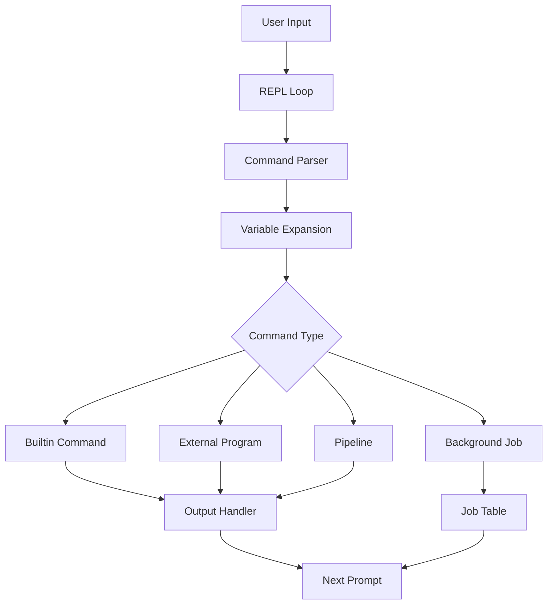
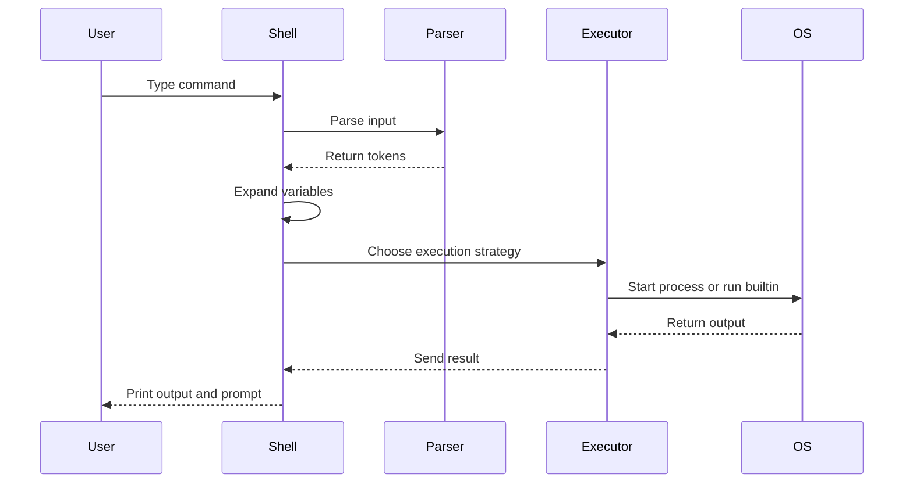
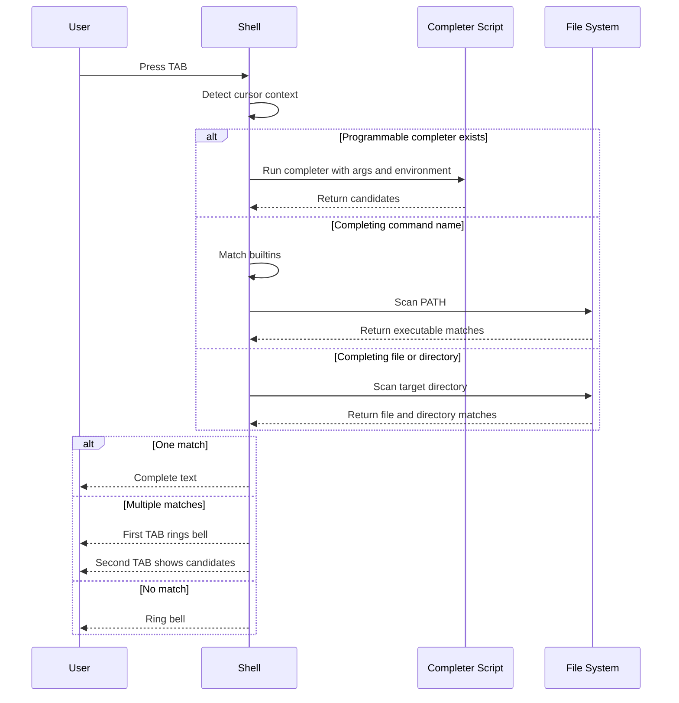
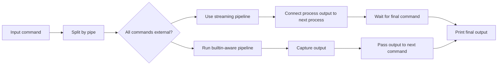
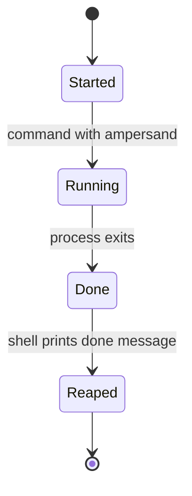
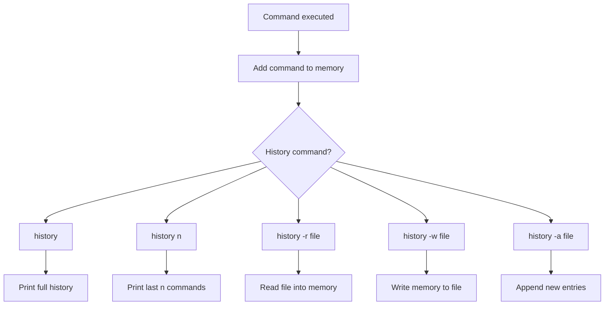
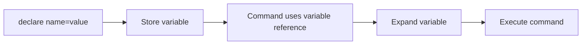
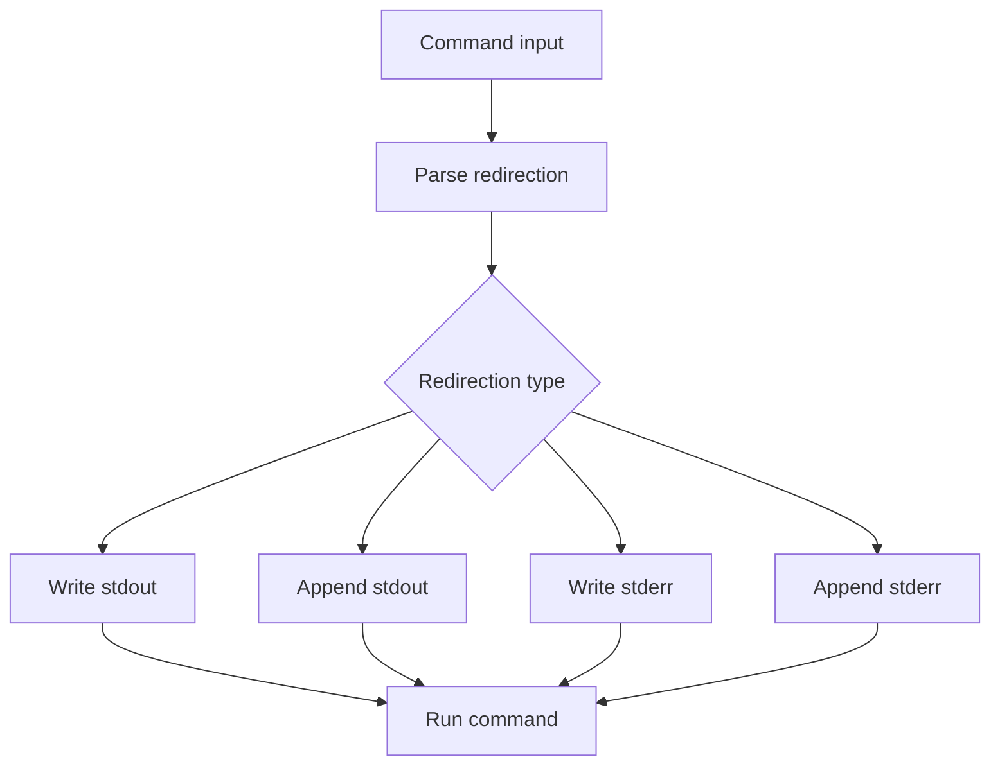

# Java Shell — Build Your Own Shell

A POSIX-inspired shell implemented in **Java** as part of the CodeCrafters **Build Your Own Shell** challenge.

This project builds a custom command-line shell from scratch. It supports command parsing, built-in commands, external programs, redirection, pipelines, background jobs, tab completion, programmable completion, command history, and shell variables.

---

## Project Overview

A shell is a command interpreter. It reads user input, understands the command, runs the required program, and prints the output.

This project implements that flow manually using Java.

```text
User types command
        ↓
Shell reads input
        ↓
Parser converts input into tokens
        ↓
Variables are expanded
        ↓
Shell decides: builtin, external command, pipeline, or background job
        ↓
Command executes
        ↓
Output is printed or redirected
        ↓
Prompt returns
```

---

## Features

### Core Shell

* Interactive REPL with `$` prompt
* External command execution using `PATH`
* Built-in commands
* Command parsing with:

  * spaces
  * quotes
  * escape characters
  * pipes
  * redirection operators
* Relative and absolute path support

### Built-in Commands

| Command    | Description                                    |
| ---------- | ---------------------------------------------- |
| `echo`     | Prints text                                    |
| `exit`     | Exits the shell                                |
| `type`     | Shows whether a command is builtin or external |
| `pwd`      | Prints current working directory               |
| `cd`       | Changes directory                              |
| `jobs`     | Lists background jobs                          |
| `complete` | Registers programmable completion              |
| `history`  | Shows and manages command history              |
| `declare`  | Stores and inspects shell variables            |

---

## System Architecture



---

## Command Execution Flow



---

## Autocompletion Engine

The autocomplete system reacts when the user presses the `<TAB>` key.

It supports:

* builtin completion
* executable completion from `PATH`
* file completion
* directory completion
* nested path completion
* multiple match listing
* longest common prefix completion
* programmable completion using `complete -C`



Example:

```bash
$ ech<TAB>
$ echo 

$ cat rea<TAB>
$ cat readme.txt 

$ cd proj<TAB>
$ cd project/
```

---

## Pipeline Engine

The shell supports normal and streaming pipelines.



Examples:

```bash
echo hello | wc
cat file.txt | head -n 3 | wc
tail -f file.txt | head -n 5
```

The shell uses streaming execution for long-running external pipelines such as:

```bash
tail -f file.txt | head -n 5
```

---

## Background Job System

Commands ending with `&` run in the background.



Example:

```bash
$ sleep 10 &
[1] 12345

$ jobs
[1]+  Running                 sleep 10 &

$ echo done
done
[1]+  Done                    sleep 10
```

Supported job features:

* background execution
* job numbers
* job number recycling
* `jobs` builtin
* running job display
* completed job reaping
* current job marker `+`
* previous job marker `-`

---

## History System

The shell stores previously executed commands.



Supported history features:

```bash
history
history 5
history -r history.txt
history -w history.txt
history -a history.txt
```

Arrow key navigation:

```text
UP arrow     previous command
DOWN arrow   next command
ENTER        execute recalled command
```

The shell also supports the `HISTFILE` environment variable.

---

## Shell Variables

The shell supports variable declaration and expansion using `declare`.



Examples:

```bash
$ declare name=Sanskar
$ echo $name
Sanskar

$ declare item=widget
$ echo stock_${item}_id
stock_widget_id
```

Supported variable features:

* `declare name=value`
* `declare -p name`
* identifier validation
* simple variable expansion
* braced variable expansion
* unset variables expand to empty string

---

## Redirection

The shell supports stdout and stderr redirection.



Examples:

```bash
echo hello > output.txt
echo world >> output.txt
invalid_command 2> error.txt
invalid_command 2>> error.txt
```

---

## Programmable Completion

The `complete` builtin allows registering external completer scripts.

```bash
complete -C /path/to/completer git
complete -p git
complete -r git
```

The shell passes completion context to the script:

```text
argv[1] = command name
argv[2] = current word
argv[3] = previous word
COMP_LINE = full command line
COMP_POINT = cursor position
```

---

## Project Structure

```text
.
├── .codecrafters/
│   └── run.sh
├── src/
│   └── main/
│       └── java/
│           └── Main.java
├── pom.xml
└── README.md
```

---

## Tech Stack

* Java
* Maven
* Unix process APIs
* CodeCrafters CLI
* Mermaid diagrams for documentation

---

## Run Locally

Compile the project:

```bash
mvn clean compile
```

Run the shell:

```bash
.codecrafters/run.sh
```

Example session:

```bash
$ echo hello
hello

$ pwd
/Users/example/codecrafters-shell-java

$ type echo
echo is a shell builtin

$ echo hello | wc
       1       1       6

$ history
    1  echo hello
    2  pwd
    3  type echo
    4  echo hello | wc
    5  history
```

---

## Run CodeCrafters Tests

```bash
codecrafters submit
```

---

## Learning Outcomes

This project helped build practical understanding of:

* how shells parse commands
* how builtins work
* how external programs are executed
* how pipes connect processes
* how redirection works
* how background jobs are tracked
* how tab completion works
* how command history is stored
* how shell variables are expanded

---

## Note

This is a learning-focused shell implementation. It is POSIX-inspired, but it is not intended to replace production shells like Bash, Zsh, or Fish.

---

## Author

Built by **Sanskar Bhanderi** as part of the CodeCrafters Build Your Own Shell challenge.
