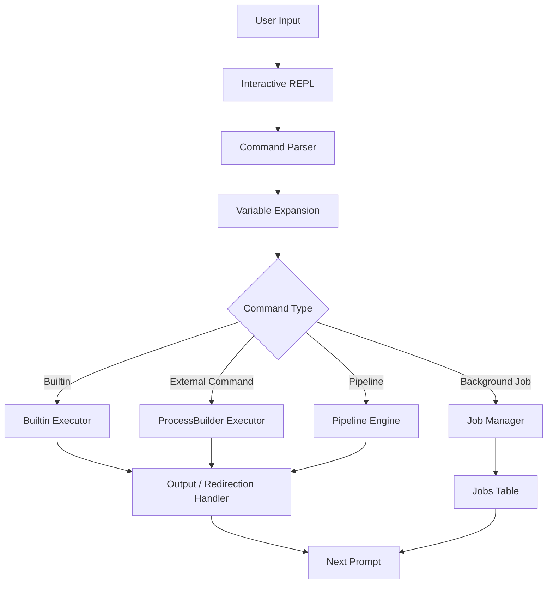
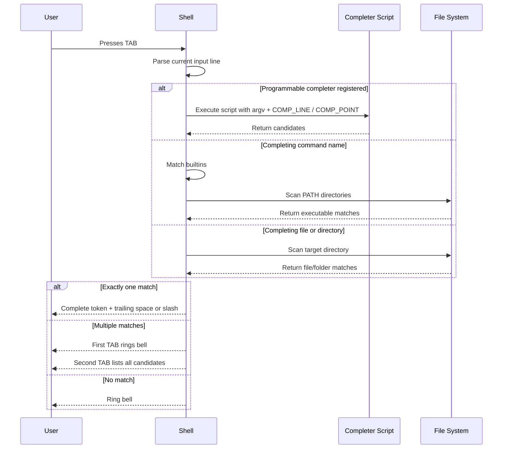
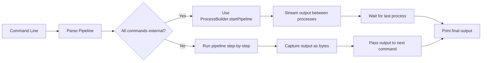
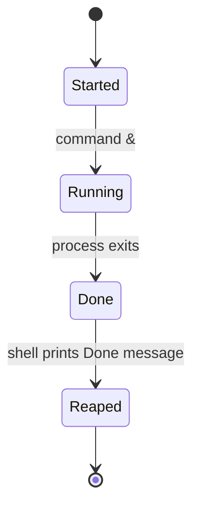
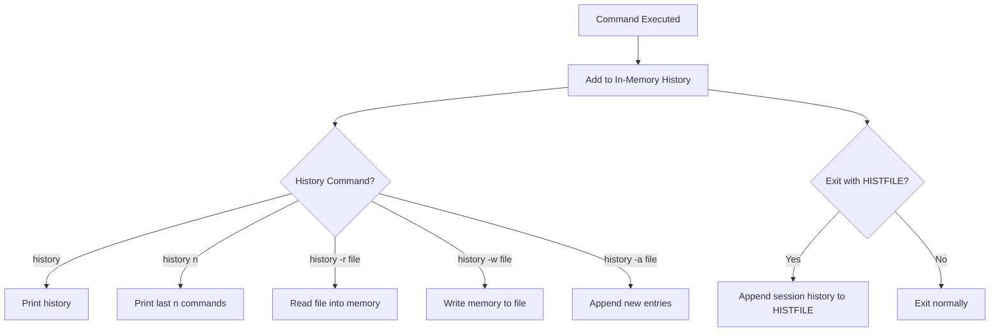
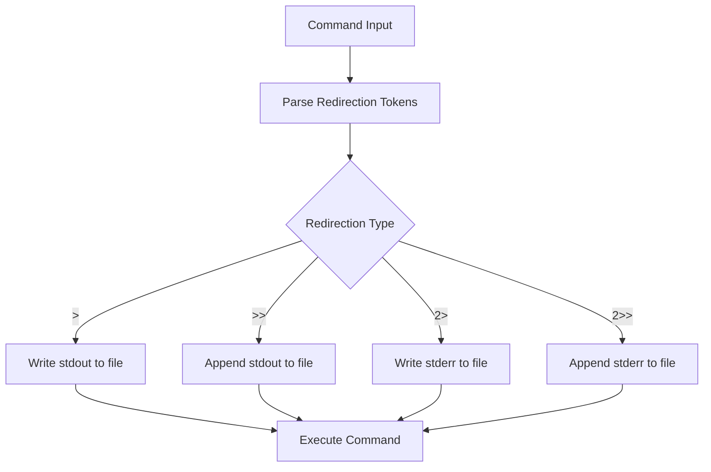
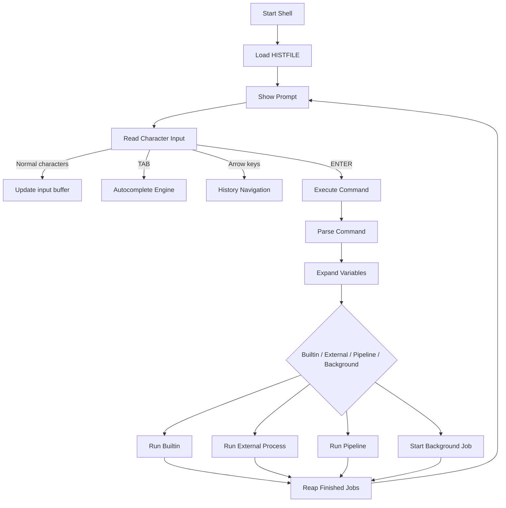

---

## System Design & Execution Flow

This shell is built around a classic REPL loop:

```text
Read command → Parse tokens → Expand variables → Detect builtins/external commands → Execute → Print result → Show next prompt
```

---

## 1. High-Level Shell Architecture



The shell keeps track of:

* current working directory
* built-in commands
* shell variables
* command history
* background jobs
* programmable completion rules

---

## 2. Autocompletion Engine

The autocomplete engine handles `<TAB>` keypresses and chooses the correct completion strategy depending on the user input.



Completion supports:

* built-in command completion
* executable completion from `PATH`
* file completion
* nested path completion
* directory completion
* multiple match listing
* longest common prefix completion
* programmable completion using `complete -C`
* completion in any argument position

Example:

```bash
$ ech<TAB>
$ echo 

$ cat rea<TAB>
$ cat readme.txt 

$ cd proj<TAB>
$ cd project/
```

---

## 3. Pipeline Execution Flow

The shell supports both built-in pipelines and streaming external pipelines.



Examples:

```bash
echo hello | wc
cat file.txt | head -n 3 | wc
tail -f file.txt | head -n 5
```

For external commands like `tail -f file | head -n 5`, the shell uses streaming pipeline execution so long-running commands do not block the entire shell.

---

## 4. Background Job Management

Background jobs are tracked in an internal jobs table.



Example:

```bash
$ sleep 10 &
[1] 12345

$ jobs
[1]+  Running                 sleep 10 &

$ echo done
done
[1]+  Done                    sleep 10
```

The job system supports:

* job numbers
* running job display
* completed job reaping
* job number recycling
* current job marker `+`
* previous job marker `-`

---

## 5. History System

The shell records every executed command in memory and supports file-based history.



Supported commands:

```bash
history
history 5
history -r history.txt
history -w history.txt
history -a history.txt
```

Arrow-key history navigation is also supported:

```text
UP arrow   → previous command
DOWN arrow → next command
ENTER      → execute recalled command
```

---

## 6. Shell Variable Expansion

The shell supports variable declaration and expansion.

```mermaid
flowchart LR
    A[declare name=value] --> B[Store variable]
    B --> C[Command contains $name or ${name}]
    C --> D[Expand variable before execution]
    D --> E[Run builtin or external command]
```

Examples:

```bash
$ declare name=Sanskar
$ echo $name
Sanskar

$ declare Item=widget
$ echo stock_${Item}_id
stock_widget_id
```

Supported variable features:

* `declare name=value`
* `declare -p name`
* valid identifier checking
* `$VAR` expansion
* `${VAR}` expansion
* unset variables expanding to empty string

---

## 7. Redirection Flow



Examples:

```bash
echo hello > output.txt
echo world >> output.txt
invalid_command 2> error.txt
invalid_command 2>> error.txt
```

---

## 8. Builtin Command Table

| Builtin    | Purpose                                       |
| ---------- | --------------------------------------------- |
| `echo`     | Print arguments                               |
| `exit`     | Exit shell                                    |
| `type`     | Show whether a command is builtin or external |
| `pwd`      | Print current directory                       |
| `cd`       | Change directory                              |
| `jobs`     | List background jobs                          |
| `complete` | Register programmable completions             |
| `history`  | Show and manage command history               |
| `declare`  | Store and inspect shell variables             |

---

## 9. Internal Flow Summary



---
